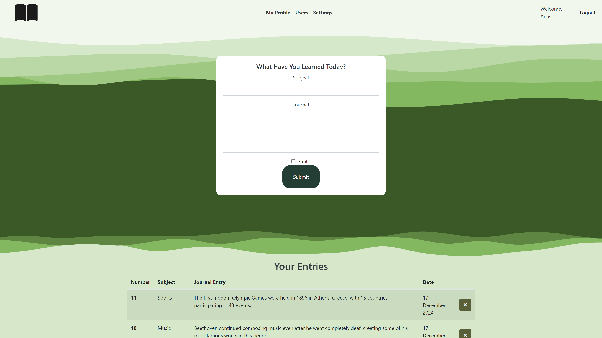

# Journaling App

A simple journaling application built with MySQL and plain PHP. Users can create and manage their journal entries, set privacy levels, and follow other users to share thoughts and reflections. This project was built to practice working with PHP, MySQL, and basic web development techniques.

## Features
- **User Authentication**: Login and registration system.
- **Create, Read, Update, and Delete Journal Entries**: Users can manage their journal posts.
- **Privacy Settings for Posts**: Control whether journal entries are public or private.
- **User Following**: Users can follow each other, though this feature is incomplete.

## Incomplete Features
The following features are currently in progress and not fully functional:
- **Following Other Users**: 
  - The system allows users to follow other users, but the functionality is incomplete. At the moment, users can follow others, and see their posts but there are no further actions or features available. This feature is incomplete.

## Installation

### Clone the Repository
To run this project locally, start by cloning the repository:

```bash
git clone https://github.com/your-username/journaling-app.git
cd journaling-app

```
## Set Up the Database

Create a MySQL database using the provided SQL dump file.
Import the database_structure.sql to set up your database structure:

```bash
mysql -u root -p < database_structure.sql
```

Set up environment variables:
Rename the .env.example file to .env and update it with your database credentials:
```bash
DB_HOST=localhost
DB_NAME=your_database_name
DB_USER=your_database_user
DB_PASSWORD=your_database_password
```

## Run the Application
This is a PHP-based application, so you’ll need a local server environment such as XAMPP, MAMP, or LAMP to run it.
Place the files in the server’s document root (e.g., htdocs for XAMPP).

Tech Stack
PHP: for the backend
MySQL: for the database
HTML/CSS: for the frontend
Database Structure
The database is defined by the database_structure.sql file. It contains tables for:

Users: Stores user information (ID, username, email, etc.).
Posts: Stores journal entries (subject, journal text, created/updated timestamps).
User Follows: Manages user relationships, allowing users to follow one another.

## Screenshots

Here are some screenshots of the application:





